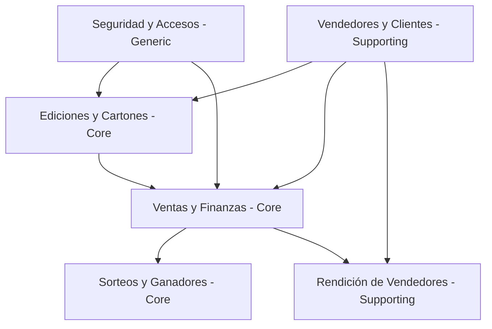

# Domain Map — Gestión Tómbola

**Estado:** Vivo (se actualiza cuando aparece/cambia un dominio)  
**Última revisión:** 2026-08-25

---

## 1. Dominios identificados

### 1. Gestión de Ediciones y Cartones — Core
*   **Objetivo:** Configurar campañas de rifas y generar cartones optimizados probabilísticamente para evitar empates.
*   **Responsabilidades:**
    *   Definir parámetros de edición: cantidad de cartones, costo total, estructura de cuotas y fechas de vencimiento.
    *   Generar los cartones (`BingoCard`) utilizando algoritmos de optimización (Simulated Annealing en `edition.controllers.js`) para dispersar las combinaciones de números.
    *   Asignar cartones a los vendedores.
*   **Entidades principales:** `Edition`, `BingoCard`
*   **Depende de:** Gestión de Vendedores (para la asignación).
*   **Del que dependen:** Gestión de Ventas (se vende un cartón de una edición).

### 2. Gestión de Ventas y Finanzas (Cobros) — Core
*   **Objetivo:** Controlar el ciclo comercial y cobros periódicos de la venta de cartones.
*   **Responsabilidades:**
    *   Registrar ventas vinculando un cartón vendido a un cliente y un vendedor.
    *   Generar automáticamente las cuotas (`Quota`) según la configuración de la edición.
    *   Controlar los estados de venta (`Pendiente de pago`, `Pagado`, `Anulada`, `Entregado sin cargo`).
    *   Registrar el cobro de cuotas y actualizar reactivamente el estado de la venta a `Pagado` al completarse el cobro total.
*   **Entidades principales:** `Sale`, `Quota`
*   **Depende de:** Gestión de Ediciones y Cartones (cartón vendido), Gestión de Vendedores y Clientes.
*   **Del que dependen:** Gestión de Sorteos (solo cartones vendidos participan de premios), Rendiciones.

### 3. Sorteos y Ganadores — Core
*   **Objetivo:** Gestionar el evento de sorteo en vivo y determinar los cartones ganadores.
*   **Responsabilidades:**
    *   Registrar números cantados/sorteados en vivo.
    *   Analizar aciertos en tiempo real (Top 10 de cartones más cercanos a ganar).
    *   Registrar los ganadores y asociar los datos del comprador y vendedor a través de la venta del cartón.
*   **Entidades principales:** Lógica de sorteo en memoria y base de datos (relaciona `BingoCard` y `Sale`).
*   **Depende de:** Gestión de Ventas y Finanzas (para verificar si el cartón está vendido y quién es el comprador/vendedor).

### 4. Gestión de Vendedores y Clientes — Supporting
*   **Objetivo:** Administrar los actores comerciales y las comisiones de la red de ventas.
*   **Responsabilidades:**
    *   Registrar datos biográficos generales de personas para evitar duplicidad de nombres, DNI, teléfonos, etc.
    *   Administrar vendedores y sus tasas de comisión (`commissionRate`).
    *   Administrar clientes y asociar su historial de compras.
*   **Entidades principales:** `Seller`, `Client`, `Person`
*   **Depende de:** Seguridad y Accesos (para el enlace `User -> Person`).
*   **Del que dependen:** Gestión de Ventas y Finanzas.

### 5. Rendiciones de Vendedores (Seller Payments) — Supporting
*   **Objetivo:** Conciliar el dinero recolectado por los vendedores de forma física o virtual.
*   **Responsabilidades:**
    *   Registrar entregas de cobros de vendedores (efectivo, transferencias, cheques, tarjeta única).
    *   Calcular de forma automática las comisiones retenidas por el vendedor vs. el monto neto entregado.
*   **Entidades principales:** Registro de pagos en balance/rendición.
*   **Depende de:** Gestión de Vendedores, Gestión de Ventas y Finanzas (cuotas cobradas).

### 6. Seguridad, Autenticación y Usuarios (IAM) — Generic
*   **Objetivo:** Proteger el acceso a la aplicación y proveer identidad a los actores del sistema.
*   **Responsabilidades:**
    *   Gestionar credenciales, hash de contraseñas y sesiones seguras mediante JWT (Cookies HttpOnly).
    *   Asociar usuarios del sistema a personas físicas.
    *   Controlar los accesos y permisos mediante roles (`Administrador`, `Vendedor`, etc.).
*   **Entidades principales:** `User`
*   **Del que dependen:** Todos los demás dominios (para auditoría y autorización).

---

## 2. Bounded contexts y conceptos compartidos

| Término | Significado en Gestión de Ventas | Significado en Seguridad y Accesos | Dueño |
|---|---|---|---|
| **Vendedor (Seller)** | Actor comercial con comisión asignada y responsable del cobro de cuotas. | Rol de usuario que accede con permisos limitados al panel de tómbola. | **Gestión de Vendedores** (Venta consume su ID, Auth consume su Persona). |
| **Cliente (Client)** | Comprador del cartón, titular del plan de pagos/cuotas. | No tiene acceso al sistema (no es un usuario). | **Gestión de Clientes** |
| **Persona (Person)** | Datos biográficos para registrar ventas o contactar cobros. | Datos de identidad reales asociados a una cuenta de usuario (`User`). | **Gestión de Vendedores y Clientes** |

---

## 3. Domain Map (dependencias y flujo de valor)

---

## 4. Supuestos y preguntas abiertas
1.  **Rendición Automática:** ¿Se planea que la carga de una rendición en el módulo de pagos de vendedores afecte de manera directa y automática el estado de las cuotas (`Quota.paymentDate`), o se cargan los cobros de cuotas de manera individual y la rendición es una conciliación posterior? (Actualmente el código mantiene cobros de cuotas y rendiciones de vendedores en controladores separados).

