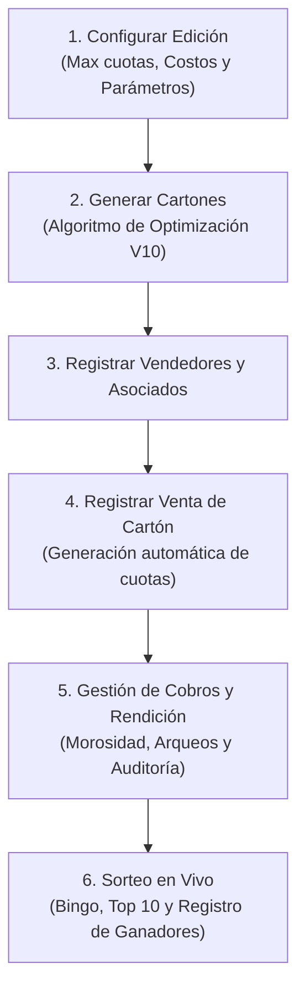

# 🗺️ Índice Maestro de Documentación: Gestión Tómbola (2026) 🔱

Este archivo centraliza la navegación de la documentación técnica y operativa del sistema de **Gestión Tómbola**, resumiendo el flujo funcional activo y la ubicación del resguardo histórico (legacy).

---

## 🚀 1. Flujo Funcional Activo (Núcleo de Negocio)

El sistema de Gestión Tómbola está diseñado como una herramienta de alta fidelidad contable y operativa para la comercialización y sorteo de cartones del club. Su flujo operativo se compone de los siguientes módulos:

### 🧱 Detalle de Procesos
1.  **Edición y Configuración**: Define los parámetros del sorteo, precio total, cantidad de cartones a emitir, el plan de cuotas y fechas de vencimiento.
2.  **Motor de Generación (Simulated Annealing)**: Genera la matriz de números para los cartones garantizando la mínima probabilidad de ganadores simultáneos (empates del primer premio) castigando el solapamiento excesivo de números en un mismo cartón.
3.  **Gestión de Ventas**: Asocia un `BingoCard` a un `Client` (asociado) y a un `Seller` (vendedor). Al confirmar la venta, cambia el estado del cartón de "Disponible" a "Vendido" y se generan automáticamente las cuotas según el plan de la edición.
4.  **Flujo Contable e Ingresos (Auditoría Financiera)**:
    *   **Cuotas**: Se gestionan los pagos individuales. Cuando un cliente abona todas sus cuotas, la venta pasa automáticamente a estado `"Pagado"`.
    *   **Rendiciones**: El vendedor rinde los montos cobrados en efectivo, transferencia o cheque. El sistema calcula comisiones de forma automática.
    *   **Arqueos de Caja**: Registro de movimientos de ingreso/egreso financiero (`Balance`) vinculados a la edición activa para auditoría.
5.  **Sorteo y Ganadores**:
    *   Carga en vivo de las bolillas extraídas.
    *   Cálculo en tiempo real de los cartones que están a punto de ganar (Top 10).
    *   Registro de ganadores de premios y entrega de premios con generación de actas.
6.  **Reporte General y Estadísticas**:
    *   Módulo de analíticas consolidadas en tiempo real para control de balance neto, canales de venta, rendimientos de vendedores, distribución geográfica de ventas y captación de nuevos asociados. Ver manual detallado de reglas de negocio contables en [reporte_general_dashboard.md](file:///docs/legacy/reporte_general_dashboard.md).

---

## 📋 2. Especificaciones de Desarrollo Activas (Flujo SDD)

A partir de agosto de 2026, el desarrollo se realiza de forma ordenada utilizando el flujo de Especificación (Spec-Driven Development):

*   **Mapa de Dominio del Negocio:** [domain-map.md](file:///docs/domain-map.md)
*   **001-sorteo-en-vivo-tv (Implementado - Agosto 2026):**
    *   [Especificación Funcional (spec.md)](file:///docs/specs/001-sorteo-en-vivo-tv/spec.md)
    *   [Plan Técnico (plan.md)](file:///docs/specs/001-sorteo-en-vivo-tv/plan.md)
    *   [Slices de Tareas (slices.md)](file:///docs/specs/001-sorteo-en-vivo-tv/slices.md)
*   **002-pagos-vendedores (Planeado - Agosto 2026):**
    *   [Especificación Funcional (spec.md)](file:///docs/specs/002-pagos-vendedores/spec.md)
    *   [Plan Técnico (plan.md)](file:///docs/specs/002-pagos-vendedores/plan.md)
    *   [Slices de Tareas (slices.md)](file:///docs/specs/002-pagos-vendedores/slices.md)

---

## 📁 3. Acceso a Documentación de Resguardo (Legacy)

Toda la documentación detallada del sistema legacy de la Fase 1 y los manuales específicos de diseño se encuentran organizados en la carpeta [docs/legacy/](file:///docs/legacy/):

### 🛡️ Estándares de Diseño y UX (Standard 2026)
*   [00-ATLAS_DOCUMENTAL.md](file:///docs/legacy/00-ATLAS_DOCUMENTAL.md): Índice original y alcance de modernización.
*   [01-SISTEMA_DISENO.md](file:///docs/legacy/01-SISTEMA_DISENO.md): Especificaciones de colores primarios (Navy), tipografías e inputs.
*   [02-ARQUITECTURA_LAYOUT.md](file:///docs/legacy/02-ARQUITECTURA_LAYOUT.md): Manejo del viewport, scroll, sidebars y z-index.
*   [03-PATRONES_COMPONENTES.md](file:///docs/legacy/03-PATRONES_COMPONENTES.md): Estructuras de tablas dinámicas, badges y celdas atómicas.
*   [04-FORMULARIOS_ALTA_GAMA.md](file:///docs/legacy/04-FORMULARIOS_ALTA_GAMA.md): Experiencia de carga de datos densos, validación e inputs.
*   [05-VISTAS_ALTA_DENSIDAD.md](file:///docs/legacy/05-VISTAS_ALTA_DENSIDAD.md): Reglas de espaciado compacto (Zero-Air) para pantallas HD (1366px).
*   [06-MODALES_ELITE.md](file:///docs/legacy/06-MODALES_ELITE.md): Ventanas modales de resumen financiero y confirmación.
*   [07-FLUIDEZ_OPERATIVA.md](file:///docs/legacy/07-FLUIDEZ_OPERATIVA.md): Comportamiento interactivo elástico del Sidebar.
*   [08-GLOSARIO_WORDING.md](file:///docs/legacy/08-GLOSARIO_WORDING.md): Nomenclatura imperativa obligatoria para etiquetas y acciones.
*   [09-CANON_TABLAS_ATOMIC.md](file:///docs/legacy/09-CANON_TABLAS_ATOMIC.md): Reglas de renderizado de tablas atómicas y layout de columnas.
*   [GUIA_UX_UI_2026.md](file:///docs/legacy/GUIA_UX_UI_2026.md): Manifiesto filosófico y operativo del Estándar 2026.

### ⚙️ Especificaciones de Ingeniería Inversa
*   [arquitectura_tecnica.md](file:///docs/legacy/arquitectura_tecnica.md): Modelos de Mongoose, esquemas y API endpoints.
*   [mapa_reglas_negocio.md](file:///docs/legacy/mapa_reglas_negocio.md): Lógica de cuotas, Simulated Annealing y reglas de sorteos.
*   [glosario_entidades.md](file:///docs/legacy/glosario_entidades.md): Tipado de datos de colecciones MongoDB.
*   [auditoria_legado_detallada.md](file:///docs/legacy/auditoria_legado_detallada.md): Análisis inicial de dependencias muertas del sistema legacy de actividades.
*   [auditoria_limpieza_status.md](file:///docs/legacy/auditoria_limpieza_status.md): Bitácora de progreso y remoción de archivos legacy.
*   [task.md](file:///docs/legacy/task.md): Registro de modernización por agentes en la fase anterior.
*   [reporte_general_dashboard.md](file:///docs/legacy/reporte_general_dashboard.md): Manual de reglas y analíticas del panel financiero.

---

## 🛠️ 4. Historial de Mantenimiento y Auditorías (2026)

*   [bitacora_saneamiento_mayo2026.md](file:///docs/legacy/bitacora_saneamiento_mayo2026.md): Registro detallado del proceso de desacople físico de archivos legacy, la modernización de la página de registro y la optimización del 25% de los archivos CSS del cliente frontend.
