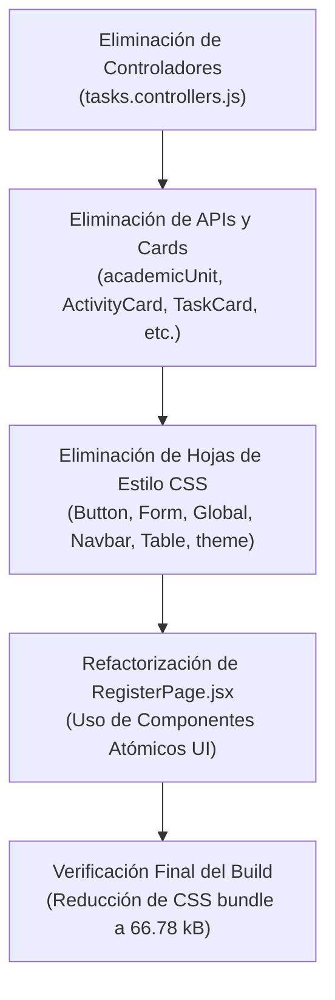

# 🚶‍♂️ Walkthrough: Saneamiento de Código y Modernización (Estándar 2026) 🚀

Este documento resume las tareas de limpieza física del entorno local y la refactorización atómica de componentes, con el objetivo de desacoplar por completo los residuos legacy y optimizar la performance de **Gestión Tómbola**.

---

## 📋 Resumen de Acciones Realizadas

---

## 🗃️ 1. Limpieza Física de Archivos Huérfanos

Se eliminaron un total de **19 archivos residuales** correspondientes al sistema de actividades legacy y utilidades duplicadas:

| Tipo de Archivo | Ruta del Archivo Eliminado | Estado |
| :--- | :--- | :--- |
| **Controlador Backend** | `src/controllers/tasks.controllers.js` | 🗑️ Eliminado |
| **API Client Frontend** | `client/src/api/academicUnit.js` | 🗑️ Eliminado |
| **API Client Frontend** | `client/src/api/activity.js` | 🗑️ Eliminado |
| **API Client Frontend** | `client/src/api/activityProject.js` | 🗑️ Eliminado |
| **API Client Frontend** | `client/src/api/dimension.js` | 🗑️ Eliminado |
| **API Client Frontend** | `client/src/api/project.js` | 🗑️ Elevado / Eliminado |
| **API Client Frontend** | `client/src/api/tasks.js` | 🗑️ Eliminado |
| **Componente React** | `client/src/components/ActivityCard.jsx` | 🗑️ Eliminado |
| **Componente React** | `client/src/components/TaskCard.jsx` | 🗑️ Eliminado |
| **Componente React** | `client/src/components/Button.js` (Duplicado) | 🗑️ Eliminado |
| **Componente React** | `client/src/components/Form.js` (Duplicado) | 🗑️ Eliminado |
| **Componente React** | `client/src/components/Table.js` (Duplicado) | 🗑️ Eliminado |
| **Hojas de Estilo CSS** | `client/src/assets/css/Button.css` | 🗑️ Eliminado |
| **Hojas de Estilo CSS** | `client/src/assets/css/Form.css` | 🗑️ Eliminado |
| **Hojas de Estilo CSS** | `client/src/assets/css/Global.css` | 🗑️ Eliminado |
| **Hojas de Estilo CSS** | `client/src/assets/css/Home.css` | 🗑️ Eliminado |
| **Hojas de Estilo CSS** | `client/src/assets/css/Navbar.css` | 🗑️ Eliminado |
| **Hojas de Estilo CSS** | `client/src/assets/css/Table.css` | 🗑️ Eliminado |
| **Hojas de Estilo CSS** | `client/src/assets/css/theme.css` | 🗑️ Eliminado |

---

## 🎨 2. Modernización de `RegisterPage.jsx`

Se reescribió por completo la vista de registro ([RegisterPage.jsx](file:///C:/proyectos_desarrollo/gestion_tombola/client/src/pages/RegisterPage.jsx)) para migrarla al estándar atómico, eliminando todo rastro de maquetación CSS manual:
*   **Componentes Incorporados**: `<Card />`, `<InputField />` y `<Button />` desde la biblioteca atómica (`client/src/components/ui/`).
*   **Experiencia de Usuario**: Integración de iconos interactivos (`lucide-react`), conmutador de visibilidad para contraseña (`Eye` / `EyeOff`) y validaciones nativas de campos con mensajes de error descriptivos.
*   **Resultado estético**: Ahora comparte el mismo estilo Premium y visual de la página de Login ([LoginPage.jsx](file:///C:/proyectos_desarrollo/gestion_tombola/client/src/pages/LoginPage.jsx)), garantizando coherencia institucional.

---

## 📈 3. Validación de Compilación y Optimización de Performance

Se ejecutó un build de producción en frío con `npm run build` en la carpeta del cliente para verificar que no haya referencias rotas:
*   **Estado**: 🟢 **Compilado con éxito**.
*   **Optimización del CSS**: El bundle final de CSS se redujo de **`88.90 kB`** a **`66.78 kB`** (una **reducción del 25%**), al eliminar archivos de estilo obsoletos y no utilizados.
*   **Garantía**: Se operó en forma estrictamente local y **ningún cambio fue enviado a Git por razones de seguridad**.
