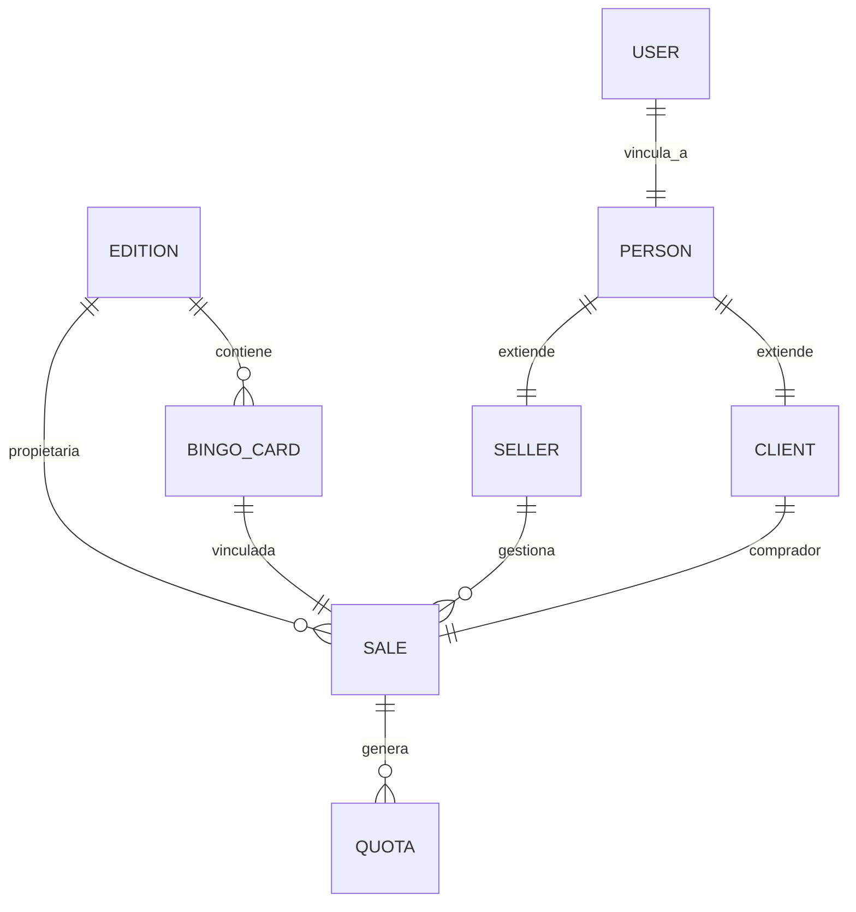

# Arquitectura Técnica: Sistema de Gestión de Tómbola (2024-2025)

Este documento describe la infraestructura tecnológica, el esquema de base de datos y la organización de componentes del sistema.

## 1. Stack Tecnológico

- **Backend**: Node.js v18+ con Express.
- **Base de Datos**: MongoDB (Documental) gestionada por Mongoose.
- **Frontend**: React 18 con Vite, Tailwind CSS y Bootstrap 5.
- **Validación**: Zod (Backend) y React Hook Form (Frontend).
- **Autenticación**: JWT (JSON Web Tokens) con Cookies integradas.
- **Manipulación de Fechas**: Day.js.

## 2. Organización del Código (Backend)

| Carpeta | Propósito |
| :--- | :--- |
| `src/models` | Definición de esquemas de Mongoose y Hooks (Pre-save). |
| `src/controllers` | Lógica de negocio pura, validaciones y respuestas HTTP. |
| `src/routes` | Definición de endpoints y aplicación de middlewares. |
| `src/schemas` | Esquemas de validación Zod para payloads entrantes. |
| `src/middlewares` | Validación de tokens, roles y esquemas. |

## 3. Esquema de Base de Datos y Relaciones

El sistema es relacional por naturaleza (IDs de MongoDB) pero implementado en una base de datos documental.

### Relaciones Core

### Restricciones Críticas (Constraints)
- **Unicidad de Edición**: `Edition.name` es único. No pueden existir dos ediciones con el mismo nombre en 2024/2025.
- **Unicidad de Cartón**: `BingoCard.number` es único por cada `Edition`.
- **Integridad de Venta**: Una venta no puede crearse si el `BingoCard` ya tiene estado "Vendido" (Validado en `createSale`).
- **Trazabilidad**: Todas las entidades principales (`Sale`, `BingoCard`, `Edition`) guardan una referencia `user` (ObjectId) que identifica quién creó el registro.

## 4. Flujo de Autenticación y Autorización

1.  **Login**: El controlador `auth.controllers.js` busca al `User`, compara el hash de `bcrypt` y genera un Token de acceso.
2.  **Transporte**: El token se envía al cliente mediante una **Cookie HTTP-only** llamada `token`.
3.  **Middleware**: `authRequired` (en `middlewares/validateToken.js`) verifica el token en cada petición protegida.
4.  **Roles**: El frontend (`App.jsx`) redirige a la página `/unauthorized` si el rol del usuario en el contexto no coincide con el `allowedRoles` de la ruta.

## 5. Endpoints de API Estándar (Consolidado)

| Categoría | Ruta Base | Métodos |
| :--- | :--- | :--- |
| **Autenticación** | `/api/auth` | Register, Login, Logout, Verify, Profile |
| **Ediciones** | `/api/editions` | GET, POST, PUT, DELETE |
| **Ventas** | `/api/sales` | GET, POST (Create+Quotas), PUT, DELETE |
| **Cuotas** | `/api/allQuotas` | GET (Paginado), PUT (Update status) |
| **Sorteos** | `/api/draws` | GET, POST, PUT (Winner registration) |

> [!WARNING]
> **Alerta Técnica**: El sistema utiliza un modelo `Counter` global. Si este contador se corrompe o se modifica manualmente en MongoDB, las nuevas ventas o vendedores podrían tener colisión de números (`Duplicate Key Error`).
