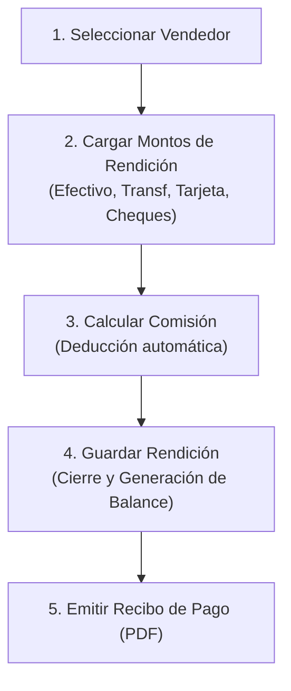

# Especificación Funcional Integral — Módulo de Rendiciones y Pagos de Vendedores

**Estado:** Completo (Agosto 2026)  
**Carpeta:** `docs/specs/002-pagos-vendedores/`

---

## 1. Introducción y Propósito del Módulo
El **Módulo de Rendiciones y Pagos de Vendedores** es la herramienta contable del sistema que permite registrar los ingresos financieros traídos por los vendedores y calcular sus comisiones correspondientes a una Edición activa. 

Su propósito es:
1.  **Registrar la entrada de dinero:** Documentar cobros en efectivo, transferencias bancarias, cheques de terceros y tarjeta única.
2.  **Calcular y deducir comisiones:** Restar de forma automática el porcentaje acordado de comisión del vendedor sobre el total rendido, determinando el neto final a ingresar al club.
3.  **Auditoría Financiera automática:** Generar de forma reactiva los movimientos correspondientes en el balance general del club (arqueo de caja).
4.  **Trazabilidad y Control:** Asignar un número correlativo único a cada rendición y registrar auditoría de quién creó o quién anuló la operación.

---

## 2. Flujo de Trabajo y Casos de Uso

### Casos de Uso Principales
*   **Registrar Rendición:** El operador carga los montos rendidos por el vendedor. El sistema deduce la comisión y emite el recibo físico o PDF.
*   **Listar y Filtrar Rendiciones:** Permite auditar el histórico de rendiciones por número de pago, vendedor, estado y fechas.
*   **Anular Rendición:** Permite deshacer un registro erróneo. Al anular, se marcan tanto el pago como sus movimientos asociados en el balance con el estado `"Anulado"` de forma irreversible.

---

## 3. Reglas de Negocio Contables y de Proceso

### Cálculo de Montos
1.  **[RN-SUBTOTAL-TOTAL]** El subtotal rendido es la suma de:
    $$\text{Subtotal} = \text{Efectivo} + \text{Transferencia} + \text{Tarjeta Única} + \text{Suma de Cheques}$$
2.  **[RN-COMISION-VENDEDOR]** Cada vendedor tiene un porcentaje de comisión asignado (`commissionRate`). Al registrar la rendición, el monto de comisión se calcula y se deduce del subtotal:
    $$\text{Monto Comisión} = \frac{\text{Subtotal} \times \text{commissionRate}}{100}$$
    $$\text{Total Neto a Caja} = \text{Subtotal} - \text{Monto Comisión}$$
3.  **[RN-TIPO-PAGO-COMISION]** Si la comisión es mayor a $0, el operador debe documentar si esa comisión fue retirada en `"Efectivo"` o `"Transferencia"`.

### Controles y Restricciones
4.  **[RN-MINIMO-RENDIDO]** La suma de los montos cargados debe ser estrictamente mayor a $0 para poder registrar la rendición.
5.  **[RN-INTEGRIDAD-ANULACION]** Una rendición en estado `"Anulado"` no participa en los KPIs financieros consolidados ni en el balance activo del club.

---

## 4. Mejoras Técnicas e Idempotencia (Versión 2026)

### A. Prevención de Duplicados en Formulario (Doble Submit)
*   **Frontend:** El botón "Registrar Pago" se deshabilitará inmediatamente tras el primer clic válido. Mostrará el texto `"Registrando..."` y un indicador de carga.
*   **Backend (Blindaje de Idempotencia):** Al recibir la petición `POST /api/sellerpayments`, el controlador de backend verificará en base de datos si ya existe un registro creado para el **mismo vendedor**, **misma edición** y por los **mismos montos** en los últimos **10 segundos**. Si coincide, rechazará la creación duplicada devolviendo un error `409 Conflict` (o el recurso ya existente) para impedir registros correlativos duplicados generados por reintentos de red o errores de navegación.

### B. Optimización del Rendimiento (Paginación en Memoria)
*   El listado de pagos implementará controles de paginación al pie de la tabla, mostrando bloques iniciales de **25 registros** (configurable a 50, 100 o 200).
*   El filtrado por buscador y edición se procesará sobre el array total de datos en memoria para mantener búsquedas instantáneas en tiempo real, segmentando el DOM dinámicamente a la página actual seleccionada.
*   Al aplicar filtros o cambiar la edición seleccionada, el control de paginación volverá automáticamente a la **Página 1**.

### C. Experiencia de Operación Fluida (Auto-focus)
*   Al ingresar a la vista de creación del pago, el selector de vendedor (`ReactSelect`) recibirá el foco de teclado automáticamente, permitiendo al operador buscar escribiendo el apellido del vendedor de inmediato.

---

## 5. Esquema de Datos y API

El módulo se compone de la colección `SellerPayment` de MongoDB:
*   `sellerPaymentNumber`: Autoincremental numérico único de auditoría.
*   `edition`: Referencia a `Edition` (Edición activa).
*   `seller`: Referencia a `Seller` (Vendedor receptor).
*   `cashAmount` / `transferAmount` / `tarjetaUnicaAmount` / `checkAmount`: Montos parciales.
*   `checks`: Array de objetos representando cheques cargados (Número, Banco, Plaza, Fecha, Monto).
*   `commissionRate` / `commissionAmount`: Porcentaje y monto deducido de comisión.
*   `commissionType`: `'Efectivo'` | `'Transferencia'`.
*   `status`: `'Activo'` | `'Anulado'`.
*   `createdBy` / `canceledBy` / `canceledAt`: Campos de auditoría.
